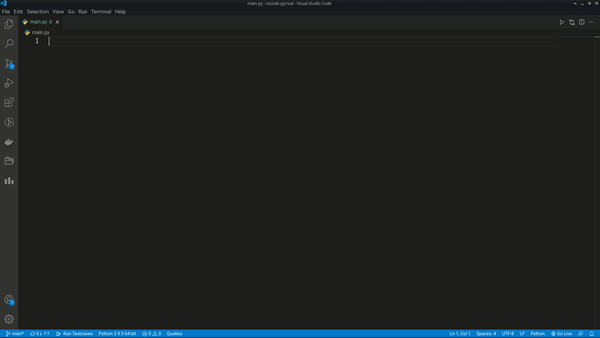

# Pyrival Vs Code Extension

### A Python 'library' for Competitive Programming

Ever been trying to start with a competitive programming template?

This extension will solve the issue for you and your up and running with a full template.

## Shortcuts / Commands

### Algebra Commands

| **Command**    | **Help Text **                                                |
| -------------- | ------------------------------------------------------------- |
| alg.crt        | Creates Chinese Remainder Theorem (Multivariable) Template    |
| alg.dlog       | Creates Discrete Logarithm Template                           |
| alg.lcmngcd    | Creates LCM and GCD Template                                  |
| alg.factor     | Creates Integer Factorization Template                        |
| alg.fft        | Creates Fast Fourier Transform Template                       |
| alg.fst        | Creates Fast Subset Transform Template                        |
| alg.ntt        | Creates Number Theoretic Transform Template                   |
| alg.isprime    | Creates Deterministic Miller-Rabin Primality Test Template    |
| alg.modsqrt    | Creates Tonelli–Shanks Algorithm Template                     |
| alg.midinv     | Creates Generalized Modular Inverse Template                  |
| alg.phi        | Creates Euler's Phi Function Template                         |
| alg.proot      | Creates Primitive Root Template                               |
| alg.sieve      | Creates Sieve of Eratosthenes Template                        |

### Combinatorics Commands

| **Command**    | **Help Text **                                            |
| -------------- | --------------------------------------------------------- |
| comb.general   | Creates General Purpose Numbers (Combinatorics) Template  |
| comb.lucas     | Creates Lucas's Theorem Template                          |
| comb.part      | Creates Partition Function Template                       |

### Data Structures Commands

| **Command** | **Help Text **                                 |
| ----------- | ---------------------------------------------- |
| ds.barr     | Creates Bit Array Template                     |
| ds.ftree    | Creates Binary Indexed (Fenwick) Tree Template |
| ds.frac     | Creates Fraction Template                      |
| ds.cfrac    | Creates Continued Fraction Template            |
| ds.dset     | Creates Disjoint-Set (Union Find) Template     |
| ds.node     | Creates Generic Nodes Template                 |
| ds.llist    | Creates Linked List Template                   |
| ds.rquery   | Creates Range Query Data Structure Template    |
| ds.lstree   | Creates (Lazy) Segment Tree Template           |
| ds.pstree   | Creates Persistent Segment Tree Template       |
| ds.slist    | Creates Sorted List Template                   |
| ds.treap    | Creates Treap Template                         |
| ds.trie     | Creates Trie Template                          |
| ds.twosat   | Creates 2-satisfiability Template              |
| ds.heapq    | Creates Heapq Template                         |
| ds.convex   | Creates Convex Hull Trick Template             |

### Geometery Commands

| **Command**    | **Help Text **                       |
| -------------- | ------------------------------------ |
| geo.convex     | Creates Convex Hull Template         |
| geo.lines      | Creates Lines Function Template      |
| geo.polygons   | Creates Polygon Functions Template   |
| geo.vectors    | Creates Vectors Function Template    |

### Graphs Commands

| **Command**    | **Help Text **                                              |
| -------------- | ----------------------------------------------------------- |
| graph.bellman  | Creates Bellman-Ford Algorithm Template                     |
| graph.bfs      | Creates Breadth First Search Template                       |
| graph.ccs      | Creates Bellman-Ford Algorithm Template                     |
| graph.brent    | Creates Brent's Algorithm for Cycle Detection Template      |
| graph.dfs      | Creates Depth First Search Template                         |
| graph.dijkstra | Creates Dijkstra's Algorithm Template                       |
| graph.euler    | Creates Eulerian Path Template                              |
| graph.pathcon  | Creates Path Constructor Template                           |
| graph.floyd    | Creates Floyd-Warshall Algorithm Template                   |
| graph.bcheck   | Creates Bipartite Graph Check Template                      |
| graph.kruskal  | Creates Kruskal's Algorithm with Disjoin Set Union Template |
| graph.prim     | Creates Prim's Algorithm Template                           |
| graph.tarjan   | Creates Tarjan's Algorithm Template                         |
| graph.sorttop  | Creates Topological Sorting Template                        |

### Linear Algebra Commands

| **Command**  | **Help Text **                                                                 |
| ------------ | ------------------------------------------------------------------------------ |
| lalg.matrix  | Creates Matrix Arithmetic, Exponentiation, Determinant, and Inverse Template   |
| lalg.maxxor  | Creates Gaussian Elimination Template                                          |
| lalg.crt     | Creates Multivariable Chinese Remainder Theorem Template                       |

### Numerical Commands

| **Command**     | **Help Text **                                 |
| --------------- | ---------------------------------------------- |
| num.hill        | Creates Hill Climbing Algorithm Template       |
| num.integrate   | Creates Approximate Integration Template       |
| num.interpolate | Creates Polynomial Interpolation Template      |
| num.iroot       | Creates Integer Roots Template                 |
| num.search      | Creates Binary Search Template                 |
| num.linear      | Creates Linear Recurrence Template             |

### Strings Commands

| **Command**   | **Help Text **                                            |
| ------------- | --------------------------------------------------------- |
| str.hashing   | Creates Knuth–Morris–Pratt Algorithm Template             |
| str.lcs       | Creates Longest Common/Palindromic Subsequences Template  |
| str.lpsub     | Creates Longest Palindromic Substring Template            |
| str.minrot    | Creates Lydon Factorization Template                      |
| str.zfun      | Creates Z Algorithm Template                              |
| str.lcsub     | Creates Longest Common Substring Template                 |

### Miscellaneous Commands

| **Command**       | **Help Text **                                   |
| ----------------- | ------------------------------------------------ |
| !temp             | creates master template for cp                   |
| misc.bootstrap    | Creates bootstrap for recursion template         |
| misc.fastio       | Creates FastIO Template                          |
| misc.osort        | Creates Order Sort Template                      |
| misc.random       | Creates random template                          |
| misc.split        | Creates String Split Template                    |
| misc.bithack      | Creates Bit Hacks Template                       |
| misc.mod          | Creates 32-bit Modular Arithmetic Template       |
| misc.memoize      | Creates Memoize Decorators Template              |
| misc.ostream      | Creates C++ syle cout Template                   |
| misc.alphabeta    | Creates Alpha–Beta Pruning Template              |
| misc.lis          | Creates Longest Increasing Subsequence Template  |
| misc.ostat        | Creates K-th Order Statistic Template            |

## Known Issues

No known issues so far.
 ## Credits

- [@PyRival](https://github.com/cheran-senthil/PyRival)
